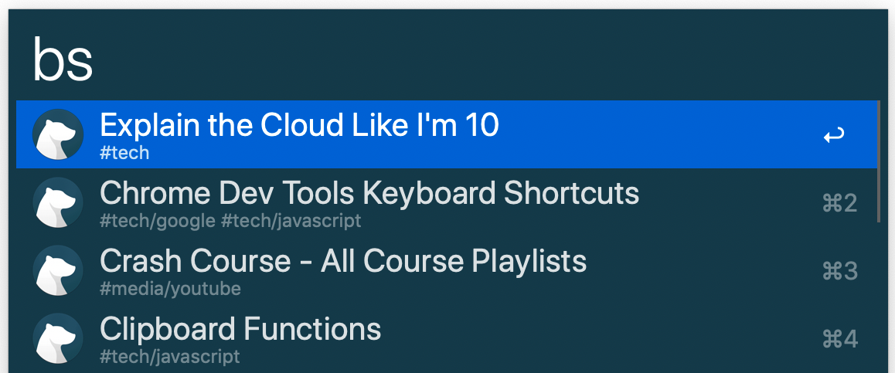
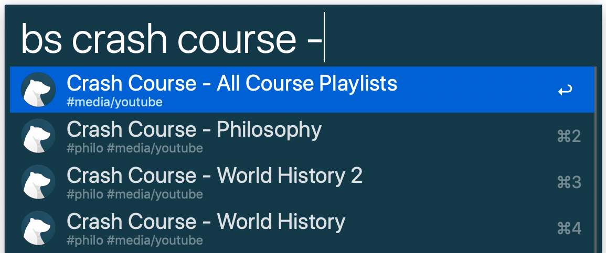
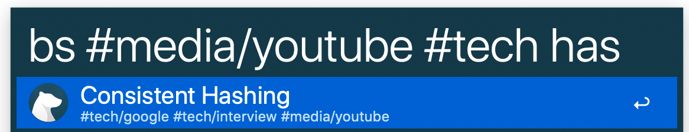
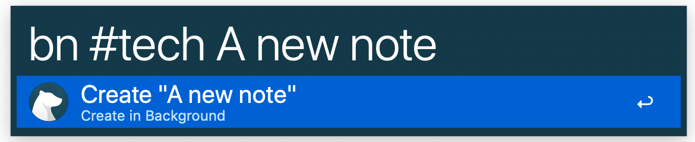
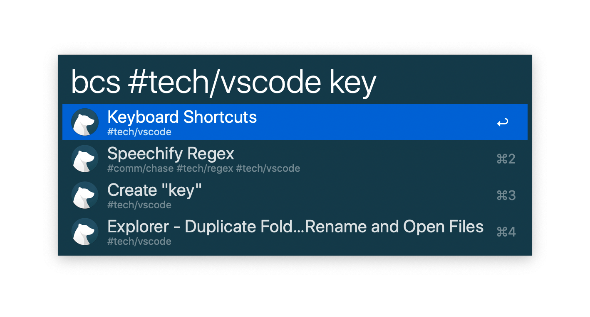

# Bear Workflow
Streamlined note searching and creation for [Bear](http://www.bear-writer.com/) using [Alfred](https://www.alfredapp.com/workflows/).

## Install
Just [download](https://github.com/drgrib/alfred-bear/releases/download/1.1.1/Bear.alfredworkflow) the latest release and double-click _Bear.alfredworkflow_. Alfred will open the workflow and install it.

## Search
`bs` or `bsearch`

### Recent Notes
Leave the search field empty to see recent notes with their tags as subtitles.

### Basic Search
Start typing to search through the titles and text of most recent notes, title matches first.

### Tag Search
Type `#` at any time to autocomplete your tags.

Start typing to search tags.

Once completed, the notes will be filtered by that tag.

Add more tags to filter by multiple tags.

Start typing to search titles and text within a tag.

All these terms can be typed in any order and they will work the same. For example, if you want to add a tag after typing a bare search term, the autocomplete will still help you. Or if you remember you want to filter by another tag after typing the first tag and a bare search term, you can autocomplete and add the second tag by typing `#` again.

### Link Pasting

While in your Bear notes, you can paste a link to another note by searching for it and holding down the command key.

## New Notes
`bn` or `bnew` followed by title and optional tags.

Tag autocomplete works the same. Also, any text in your clipboard can be added to the new note by holding down the command key.

## Create/Search
`bcs` or `bcsearch`

You may find sometimes that you want to retrieve a note if it exists and create it if it does not. This command provides that functionality by combining the behavior of search and create. It will provide all the same search results as normal search and additionally add a create item third in the list using normal create options.

If there are less than two search items, the create item will be the last or only item.

You can additionally create links to notes by holding the command key while selecting a search item. Selecting the create item while holding the command key will do nothing.

## Why I created this
I am especially grateful to Chris Brown, who created a [Python based Bear workflow](https://github.com/chrisbro/alfred-bear). It was the basis for this project. However, I decided to create my own project for a few reasons:

- Compiled Go is faster than interpretted Python. Not that much faster but fast enough for me to notice when searching and creating notes throughout the day.
- I wanted the features involving tag searching and autocompletion, link pasting, and automatic clipboard note content.
- I wanted fewer, more optimized SQL queries into the Bear database to increase speed since this appears to be the main bottleneck on performance.
